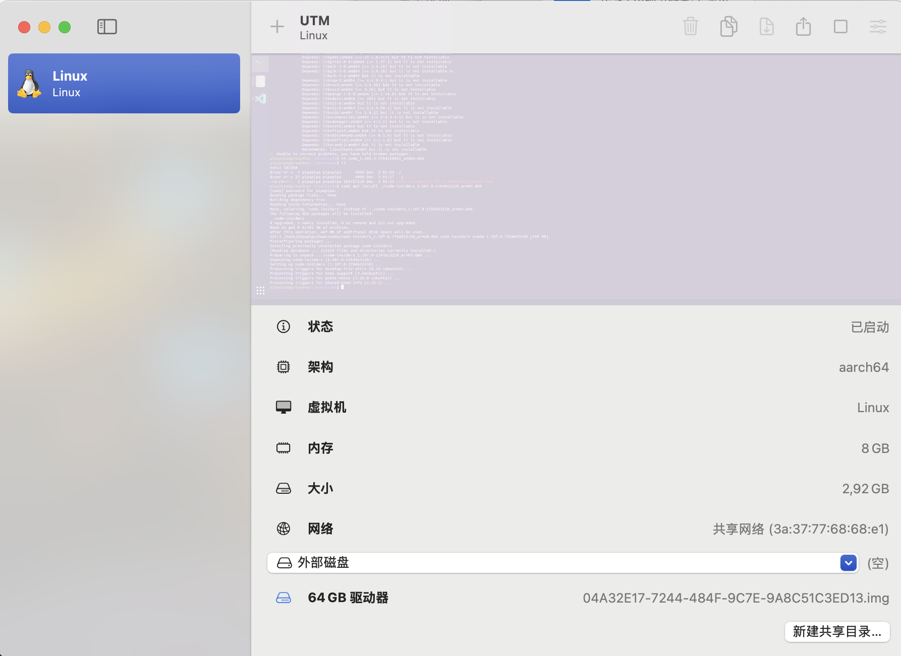
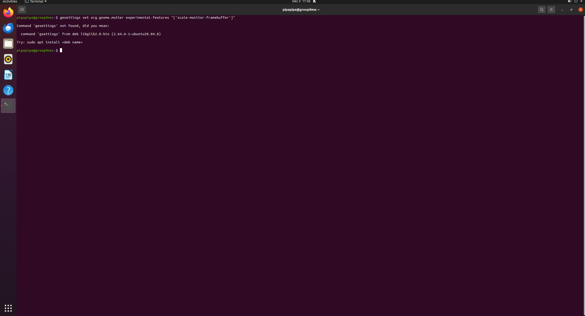
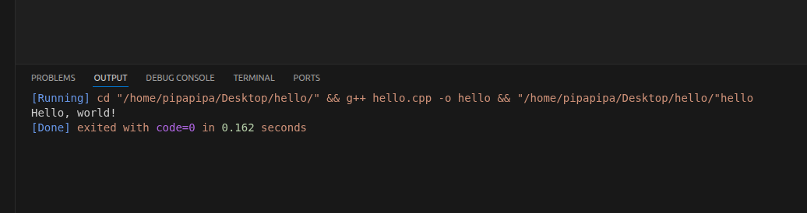

# Week1任务报告

## 目录

- [Linux系统安装](#linux系统安装)
  - [UTM安装与Linux装配](#utm安装与linux装配)
  - [虚拟机配置](#虚拟机配置)
- [VSCode安装与使用](#vscode安装与使用)
  - [在Linux系统下的VSCode界面以及cpp环境搭配](#在linux系统下的vscode界面以及cpp环境搭配)
- [Git基础操作](#git基础操作)
- [模块总结](#模块总结)


## Linux系统安装
---

### UTM安装与Linux装配

__UTM界面__

由于使用mac电脑，难以适配Ubuntu系统，所以使用UTM装载虚拟机


[UTM的安装链接](https://mac.getutm.app)





使用OrbStack_v1.10.3_19083_arm64.dmg版本
[下载链接，可以直接下载](https://cdimage.ubuntu.com/releases/22.04/release/ubuntu-22.04.5-live-server-arm64.iso)


__UTM下的Linux图形界面__





### 虚拟机配置

1. 8 GB 内存
2. 4核
3. 8192 MB


## VSCode安装与使用
---

### 在Linux系统下的VSCode界面以及cpp环境搭配


____


__C++编程__

```cpp
//检测代码
#include <iostream>

int main(){
	std::cout << "Hello, world!" << std::endl; //打印Hello, world!
	
	return 0;
}
```

__运行结果__



## Git基础操作
---

_图片面积太大遂使用Markdown代码格式说明_


```
1.首先创建一个目录git_demo，将其初始化
mkdir git_demo
cd git_demo
git init 

2.创建文件hello.txt并且添加至暂存区
echo "hello" > hello.txt
git add <filename>

3.将暂存区的文件提交
git commit

ps: 以下是添加至暂存区，以及提交文件的一次性方法。
git add . 将该路径下的所有文件提交至暂存区
git commit -a 将所有文件一次性全部提交，对新建的、未添加至暂存区的无效
git commit -m 提交的同时编写备注

4.建立分支，创造hello.txt的多个版本
git branch cat
git checkout cat 会进入cat分支
echo "Meow" >> hello.txt
git checkout master
git branch dog
git checkout dog
echo "Wolf" >> hello.txt

创建新分支并进入:
git checkout -b cat

5.合并分支
git checkout master
git merge cat
git merge dog 由于添加的都是同一行，但是不同内容，所以合并会出现合并冲突，
需要进入文件手动修改
vim hello.txt 删除其中的'=', '<', '>'并且修改代码逻辑
git add hello.txt
git merge --continue

ps: 可以同时合并多个分支
git merge <branch-a> <branch-b>
更具备可读性的解决合并冲突:
git mergetool

查看状态:
git status
查看日志:
git log
更好地查看日志
git log --all --graph --decorate --oneline
对比工作区和暂存区代码:
git diff

登陆:
git config user.name "name"
git config user.email "email_address" 
一次性登陆，后续无需再修改:
git config --global user.name "name"
git config --global user.email "email_address" 

6.上传（下载）
git remote -v 确定自己连接的远程仓库
git remote add origin <URL> 连接远程仓库
git push -u origin <branch> 上传分支

ps:
git clone <URL> 下载
git pull origin main 同步更新
git remote remove origin 删除连接
git remote set-url origin <URL> 直接覆盖

```

## 模块总结
---

- [x] 本次作业中由于mac电脑的特殊性，学会了UTM的虚拟机配置，让我用独特的视角搭建了Linux开发环境

- [x] git工具的学习中，我认识到了各个数据作为节点存储的新概念，让我明白原先难以理解的数据结构。

- [x] 在学会使用Markdown的过程，满足了我编排优美排版，以及复现出学习网站上多种多样的代码块以及数学公式的乐趣。

