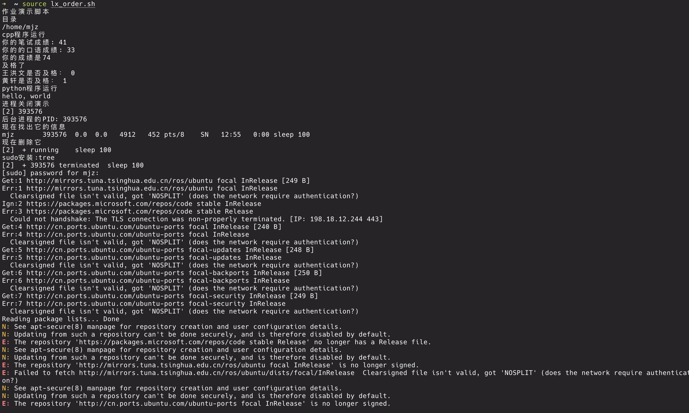
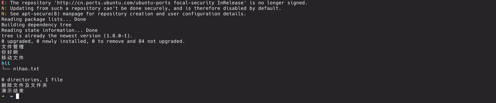
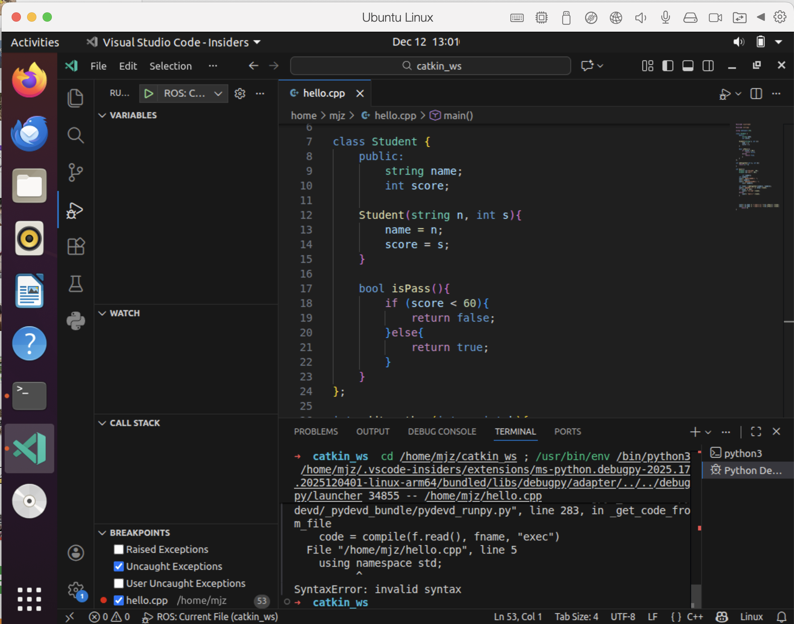
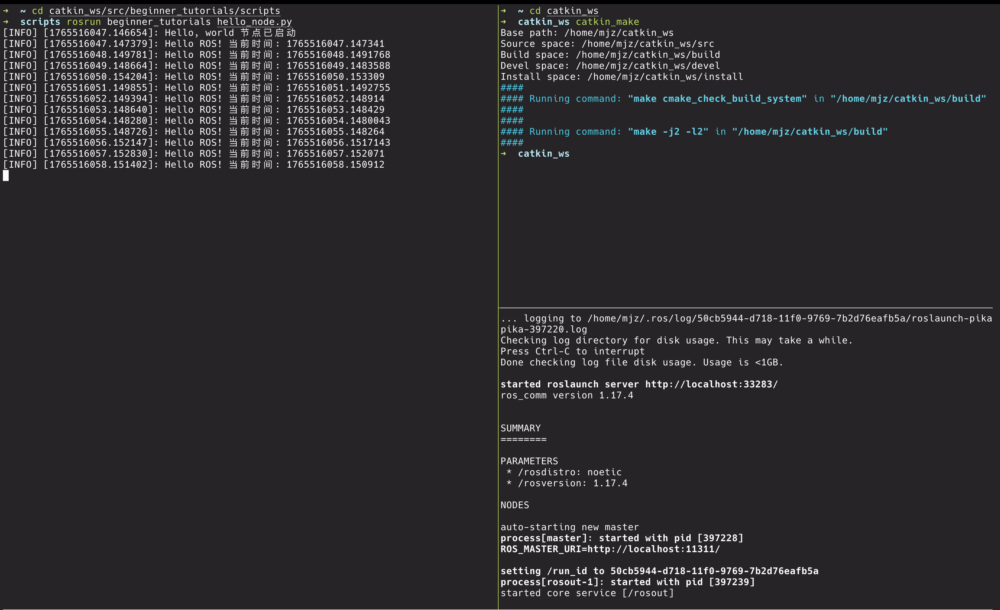
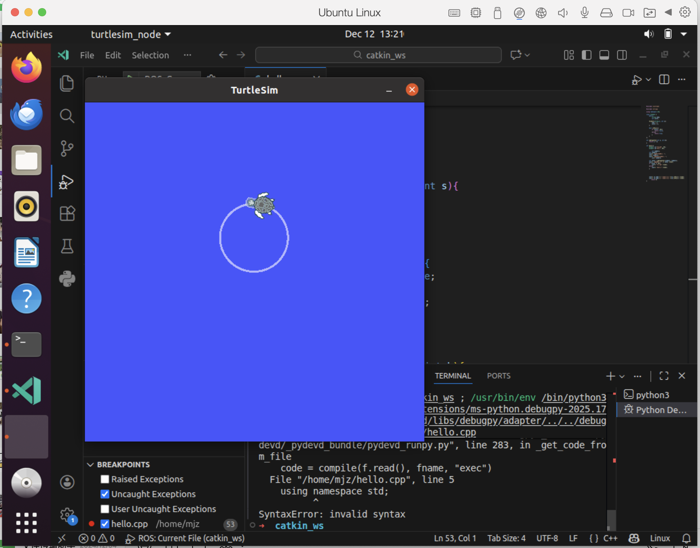
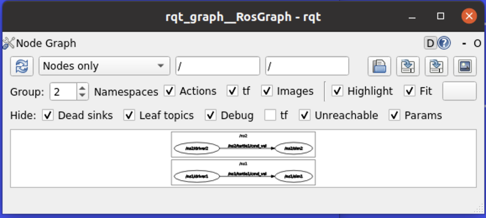
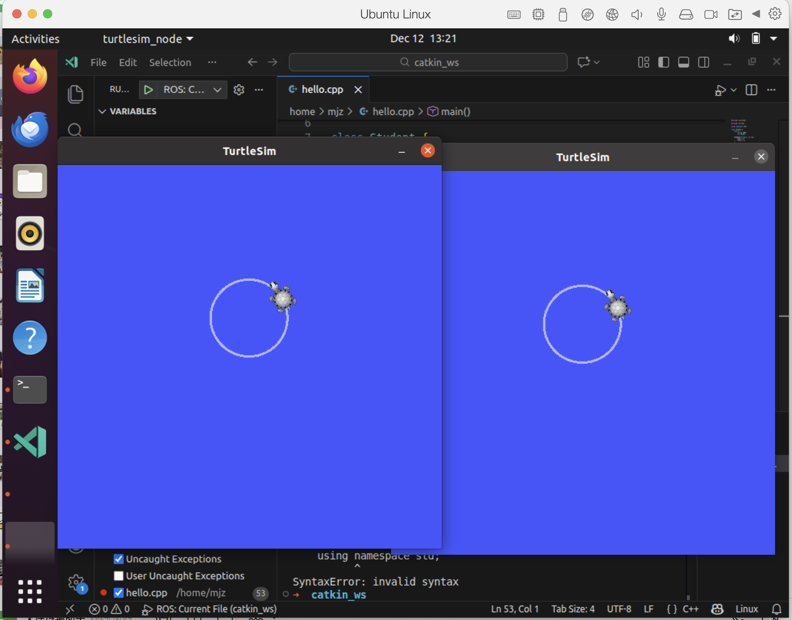

# Week 2 实操任务报告：Linux 基础与 ROS 入门


## 一、Linux 基础命令实操

### 1.1 实验目的
验证对 Linux 文件系统管理、进程控制及软件安装命令的掌握程度，并通过 Shell 脚本实现操作自动化。

### 1.2 自动化演示脚本
为了高效验证 `mkdir`, `mv`, `rm`, `ps`, `kill` 及编译运行等指令，编写了自动化测试脚本 `lx_order.sh`。

```bash
#! /bin/bash

echo "作业演示脚本"

sleep 10
echo "目录"
pwd

sleep 10
echo "cpp程序运行"
g++ -o demo hello.cpp
./demo

sleep 10
echo "python程序运行"
python3 hello.py

sleep 10
echo "进程关闭演示"
sleep 100 &
PID=$!

echo "后台进程的PID: $PID"

echo "现在找出它的信息"
ps aux | grep sleep | grep -v grep

sleep 10
echo "现在删除它"
kill $PID

jobs

echo "sudo安装:tree"
sudo apt update
sudo apt install tree -y

sleep 10
echo "文件管理"
echo '你好啊' > nihao.txt

cat nihao.txt

echo "移动文件"
mkdir hii

mv nihao.txt hii/
tree hii

sleep 10
echo "删除文件及文件夹"
rm -r hii

echo "演示结束"
```

### 1.3 运行结果分析
执行脚本后，终端记录了完整的操作流：
1.  **编程环境交互**：成功编译运行 C++ 程序并完成成绩判定交互；成功执行 Python 脚本。
2.  **进程管理**：脚本自动捕获后台 `sleep` 进程的 PID 并成功执行 kill 终止信号。
3.  **文件操作**：成功创建 `hii` 目录并将文件移动其中，最后通过 `tree` 命令验证了目录结构。




---

## 二、开发环境搭建
### 2.1 源码实现
在 Linux 环境下编写 C++ 类与对象程序，实现成绩录入与及格判断逻辑。

**C++ 核心代码 (`hello.cpp`)：**
```cpp
#include <iostream>
#include <string>
using namespace std;

class Student {
public:
    string name;
    int score;

    Student(string n, int s){
        name = n;
        score = s;
    }

    bool isPass(){
        if (score < 60){
            return false;
        }else{
            return true;
        }
    }
};

int addtogether(int a, int b){
    return a + b;
}

int main(){
    Student s1("王洪文", 40);
    Student s2("黄轩", 89);

    int number1;
    int number2;
    cout<< "你的笔试成绩: ";
    cin>> number1;
    cout<< "你的的口语成绩: ";
    cin>> number2;

    int total = addtogether(number1, number2);
    cout<< "你的成绩是" << total <<endl;
    if (total >= 60){
        cout<< "及格了" <<endl;
    }else{
        cout<< "不及格" <<endl;
    }

    cout<< s1.name << "是否及格： "<<s1.isPass() <<endl;
    cout<< s2.name << "是否及格： "<<s2.isPass() <<endl;
    return 0;
}
```

### 2.2 IDE 调试配置
使用 VSCode 配置 `launch.json`，实现了对 C++ 程序的断点调试。左侧变量监视窗口（Variables）清晰显示了当前对象属性，断点命中准确。



---

## 三、ROS 环境搭建与节点通信

### 3.1 实验步骤与验证
1.  安装 ROS Noetic 并配置环境变量。
2.  创建 `catkin_ws` 工作空间，建立 `beginner_tutorials` 功能包。
3.  **编译构建**：`catkin_make` 执行成功，进度 100%。
4.  **核心服务**：`roscore` 正常启动。
5.  **节点运行**：自定义节点成功输出带有时间戳的日志信息。



### 3.2 节点源码
**节点文件 (`hello_node.py`)：**
```python
#! /usr/bin//env python3
# -*- codeing: utf-8 -*-

import rospy

def talker():
    rospy.init_node("hello_node", anonymous = 0)
    rate = rospy.Rate(1)
    rospy.loginfo("Hello, world 节点已启动")
    
    while not rospy.is_shutdown():
        hello_str = f"Hello ROS! 当前时间: {rospy.get_time()}"
        rospy.loginfo(hello_str)
        rate.sleep()

if __name__ == '__main__':
    try:
        talker()
    except rospy.ROSInterruptException:
        pass
```

---

## 四、Turtlesim 运动控制实操

### 4.1 程序控制画圆
为了实现对机器人的精确控制，编写了 Python 脚本发布 `/cmd_vel` 话题。该程序通过设置线速度 `linear.x` 和角速度 `angular.z`，控制小乌龟进行圆周运动。

**画圆程序源码 (`circle.py`)：**
```python
#! /usr/bin/env python3
# -*- coding: utf-8 -*-

import rospy
from geometry_msgs.msg import Twist

def circle_maker():
    # 初始化节点
    rospy.init_node("circle_maker", anonymous = 0)
    rate = rospy.Rate(10)
    
    # 发布话题：turtle1/cmd_vel
    velocity_publisher = rospy.Publisher("turtle1/cmd_vel", Twist, queue_size=10)

    rospy.loginfo("画圆节点已开启")

    while not rospy.is_shutdown():
        vel_msg = Twist()

        # 设置线速度与角速度
        vel_msg.linear.x = 1.0
        vel_msg.linear.y = 0.0
        vel_msg.linear.z = 0.0

        vel_msg.angular.x = 0.0
        vel_msg.angular.y = 0.0
        vel_msg.angular.z = 0.9

        velocity_publisher.publish(vel_msg)

        rate.sleep()

if __name__ == '__main__':
    try:
        circle_maker()
    except rospy.ROSInterruptException:
        pass
```

### 4.2 运行效果
运行上述节点后，Turtlesim 仿真界面中的小乌龟成功绘制出圆形轨迹。



---

## 五、Launch 启动与命名空间

### 5.1 Launch 文件编写
为了实现多机协同仿真，编写 Launch 文件同时启动两只小乌龟，并利用 `ns` (namespace) 属性进行隔离。

**Launch 文件源码：**
```xml
<launch>
    <!-- 第一只乌龟：命名空间 ns1 -->
    <group ns="ns1">
        <node pkg="turtlesim" type="turtlesim_node" name="sim1" />
        <!-- 运行画圆脚本控制 sim1 -->
        <node pkg="beginner_tutorials" type="circle.py" name="driver1" />
    </group>

    <!-- 第二只乌龟：命名空间 ns2 -->
   <group ns="ns2">
        <node pkg="turtlesim" type="turtlesim_node" name="sim2" />
        <!-- 运行画圆脚本控制 sim2 -->
        <node pkg="beginner_tutorials" type="circle.py" name="driver2" />
    </group>
</launch>
```

### 5.2 节点关系图谱 (RQT Graph)
启动 Launch 文件后，使用 `rqt_graph` 分析系统通信架构。
**分析**：
从下图可以看出，系统成功创建了两个独立的命名空间 `/ns1` 和 `/ns2`。
*   `/ns1/driver1` 节点独立向 `/ns1/turtle1/cmd_vel` 发送指令。
*   `/ns2/driver2` 节点独立向 `/ns2/turtle1/cmd_vel` 发送指令。
两者互不干扰，验证了命名空间隔离的有效性。



### 5.3 最终运行效果
Turtlesim 成功启动了两个实例窗口，每只乌龟都在独立执行画圆动作。



---
