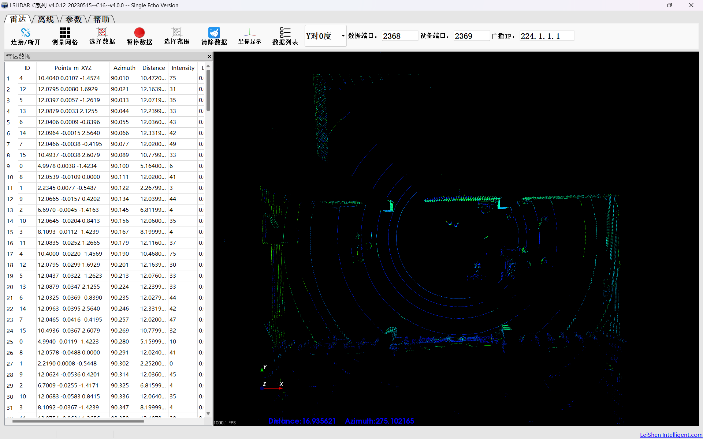
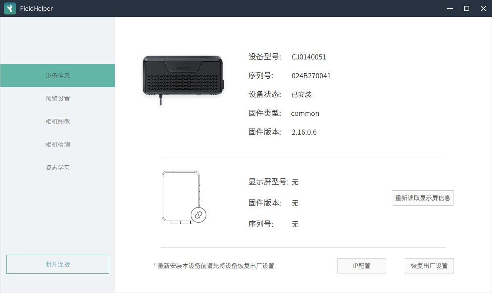
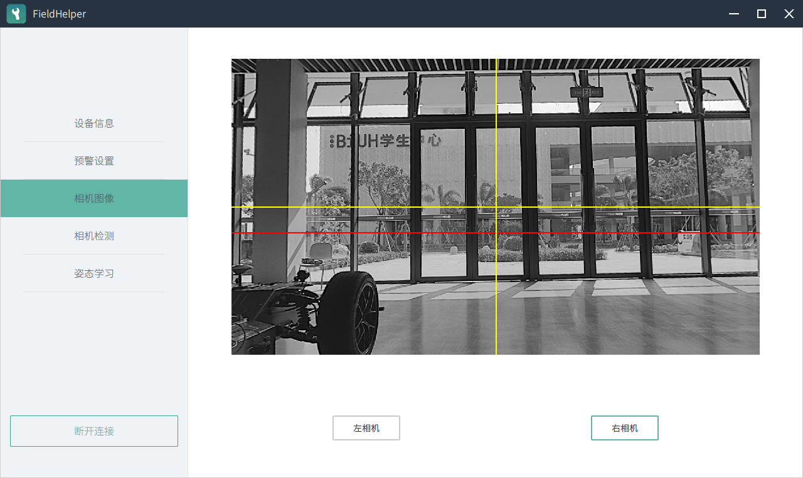
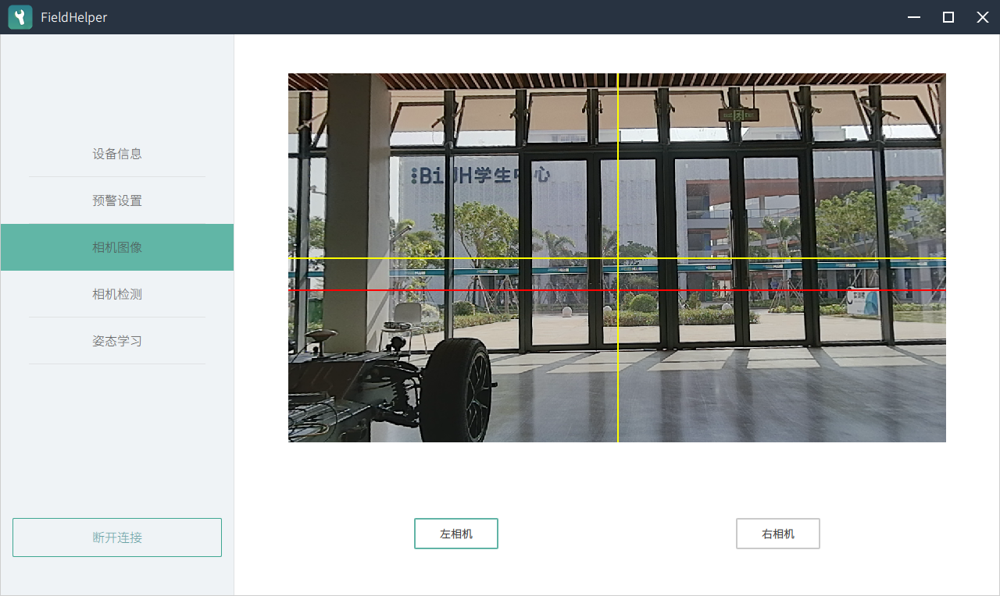
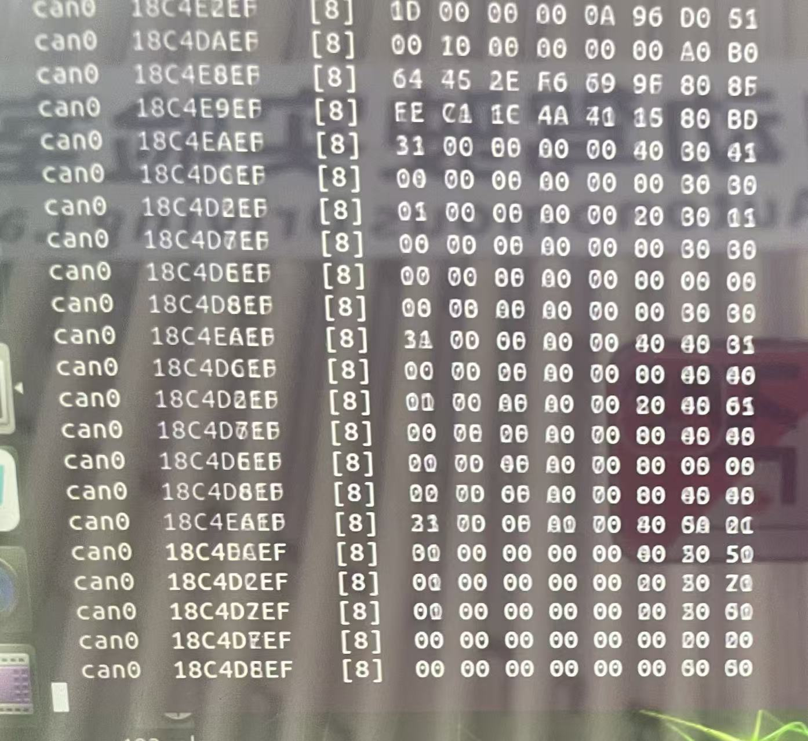

根据你提供的实拍截图，我为你完成了这份 **Week 6 任务一** 的实验报告文档。这份文档已经按照标准 Markdown 格式排版，你可以直接复制到 GitHub 仓库或你的作业文档中。

---

# 组 9 - Week 6 任务报告：实车硬件巡检与相机的标定

**实验日期：** 202X年X月X日  
**实验人员：** [填写你的姓名/组员姓名]  
**任务目标：** 完成 Windows 上位机对激光雷达、双目相机及底层通信的初步检测。

---

## 一、 任务 1：Windows 上位机初步检测

### 1.1 实验环境准备
在连接车辆传感器前，我们完成了以下配置工作：
1. **工控机状态：** 确认车辆工控机已完全关闭，防止 IP 冲突。
2. **静态 IP 设置：** 将笔记本电脑以太网卡手动设置为：
   * **IP 地址：** `192.168.1.102`
   * **子网掩码：** `255.255.255.0`
   * **网关：** `192.168.1.1`
3. **物理连接：** 通过网线直接连接笔记本与车辆传感器网口。

---

### 1.2 激光雷达 (LiDAR) 检测
使用 **LSLIDAR_C系列** 上位机软件对激光雷达进行检测。

*   **操作过程：** 打开软件后点击“连接”，成功获取实时数据流。
*   **检查要点：**
    *   **覆盖范围：** 如下图所示，点云数据能够 360° 完整覆盖周边环境。
    *   **数据质量：** 画面右侧显示实时 3D 点云，左侧数据列表刷新正常（包含 ID、Distance、Intensity 等字段），点云图像稳定，无跳动或断流。

*图1：LSLIDAR 上位机点云实时显示界面*

---

### 1.3 双目相机 (Camera) 检测
使用 **FieldHelper** 工具对双目相机进行状态检查与画面确认。

*   **设备连接：** 通过设备 IP `192.168.1.251` 成功连接相机。
*   **状态检查：**
    *   **设备信息：** 确认设备型号为 `CJ0140051`，序列号 `024B270041`，设备状态显示为 **“已安装”**，固件版本为 `2.16.0.6`。
*   **视野确认：**
    *   **左目相机：** 画面显示正常（黑白模式），视野清晰。
    *   **右目相机：** 画面显示正常（彩色模式），视野清晰。
    *   **质量判定：** 左右目画面同步，无明显卡顿，视野无遮挡。

*图2：FieldHelper 设备信息与状态确认*

*图3：左目相机实时画面预览*

*图4：右目相机实时画面预览*

---

### 1.4 底层通信链路验证 (CAN 总线)
作为硬件巡检的一部分，我们对车辆的 CAN 总线进行了报文抓取测试。

*   **检测结果：** 通过 `candump can0` 指令观察到终端有持续跳动的数据帧。
*   **验证标准：** 截图中包含多种不同的 CAN ID（如 `18C4E2EF`、`18C4DAEF` 等），证明底层 CAN 通信链路连接正常，车辆底盘数据反馈通畅。

*图5：CAN 总线原始报文抓取界面*

---

## 二、 实验总结
本次 Windows 上位机检测任务圆满完成。实验结果证明：
1. **物理链路通畅：** 笔记本能通过网线正常访问雷达、相机及 CAN 总线。
2. **传感器状态良好：** 激光雷达点云覆盖完整，双目相机左右目画面均正常显示，设备状态处于“已安装”就绪状态。
3. **数据一致性：** 各项传感器数据刷新频率符合预期，为后续 Apollo 系统内的模块调试打下了坚实的硬件基础。

**后续操作：** 实验结束后已关闭所有上位机软件，并对整车进行了断电重启处理，以确保 CAN 卡能完全启动进入后续工作模式。

